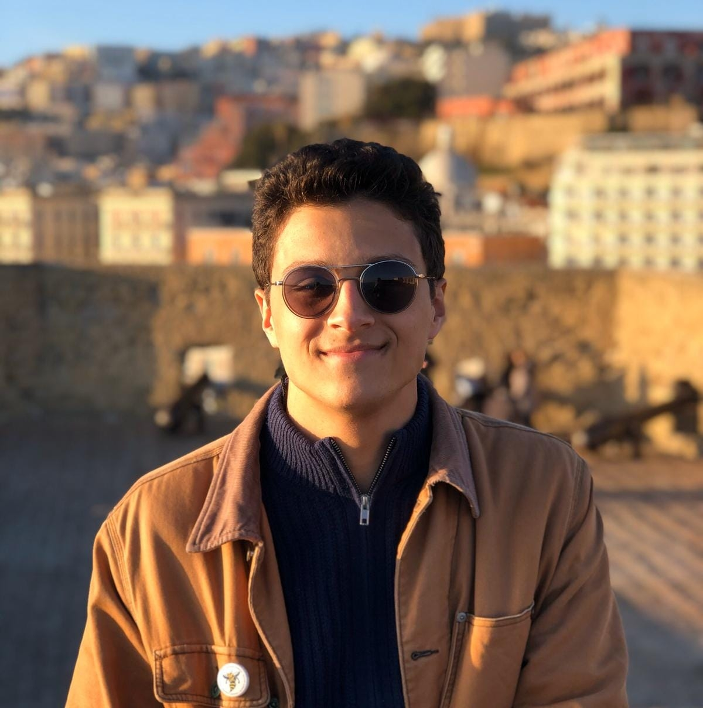

---
# Feel free to add content and custom Front Matter to this file.
# To modify the layout, see https://jekyllrb.com/docs/themes/#overriding-theme-defaults
layout: home
---
<figure>
  
 </figure>
I'm a rising fourth-year PhD student (and soon-to-be PhD candidate) in the Department of Sociology at the University of Washington! My undergrad academic background is in history, politics, film, and literature, with particular interest in American and Italian material culture. After working as associate producer on <a href="https://www.thelastlectures.com/">The Last Lectures</a> with Dr. Harry Edwards, I was inspired to pursue a PhD in sociology. My work in grad school has spanned quantitative research with statistical, demographic, and sports analytics methods, archival and content analysis about the institution of credit and the fields of sociology, political science, and economics, theory-methods integration, and sociological theory. The blurb version of academic Eddie is "a general sociologist interested in reinterpeting unresolved theoretical problems using unconventional and imaginative data and methods." I founded the department's Epistemology Working Group, I'm part of the UW Science, Technology, and Society Studies Certificate Program, and I am a recipient of the Hanauer Fellowship Award for Excellence in Western Civilization for 2026-2027.
 
 
I am deeply invested in teaching and pedagogy and see education as a personal vocation. I enjoy teaching substantive classes in sociology, especially the sociology of sport, sociological theory, and economic sociology. I also love to teach methods classes and have TAed them at many levels, from introductory stats to data visualization to graduate-level text as data. I'm also very involved in department service and have served as Grad Student Association rep to the department chair, new cohort mentor, and UAW 4121 union steward for the department. During this coming year, I will continue this service as chair of the department Grad Student Association and a head steward/bargaining team member for the union during the upcoming contract bargaining session. 
 

### Affiliations
+ PhD student, [University of Washington](http://www.uw.edu)
  + [Sociology](https://soc.washington.edu/)
  + [STSS Community](https://depts.washington.edu/stsst/category/stss-community/)
  + [Global Sport Lab](https://jsis.washington.edu/research/global-sport-lab/)
  + [Hanauer Fellowship for Excellence in Western Civilization](https://soc.washington.edu/news/2026/06/18/edward-hock-and-lindsay-maurer-chosen-joff-hanauer-award-excellence-western)
+ BA (2021), [University of Rochester](https://www.rochester.edu/)
  + [History](https://www.sas.rochester.edu/his/)
  + [ATHS](https://www.rochester.edu/college/aths/)
  + [Italian Studies](https://www.sas.rochester.edu/mlc/undergraduate/italian.html)
  
